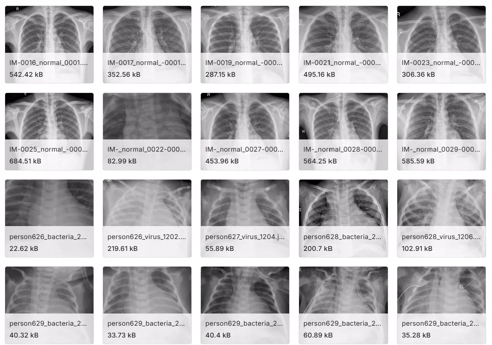
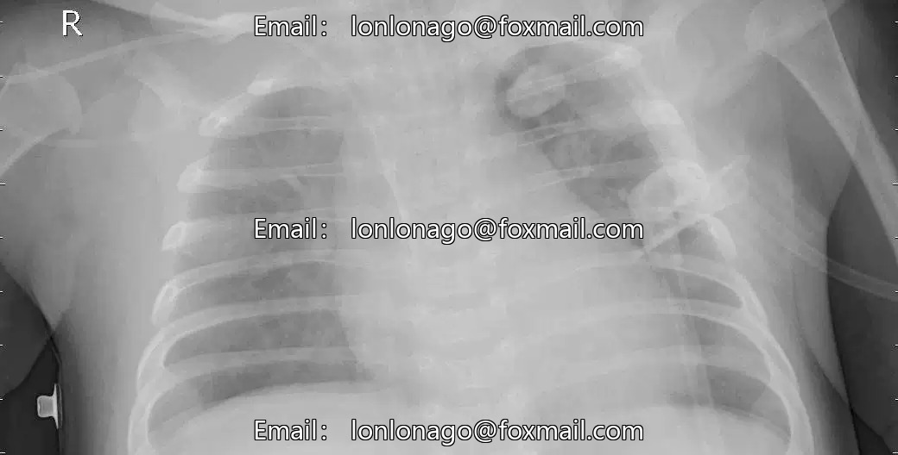
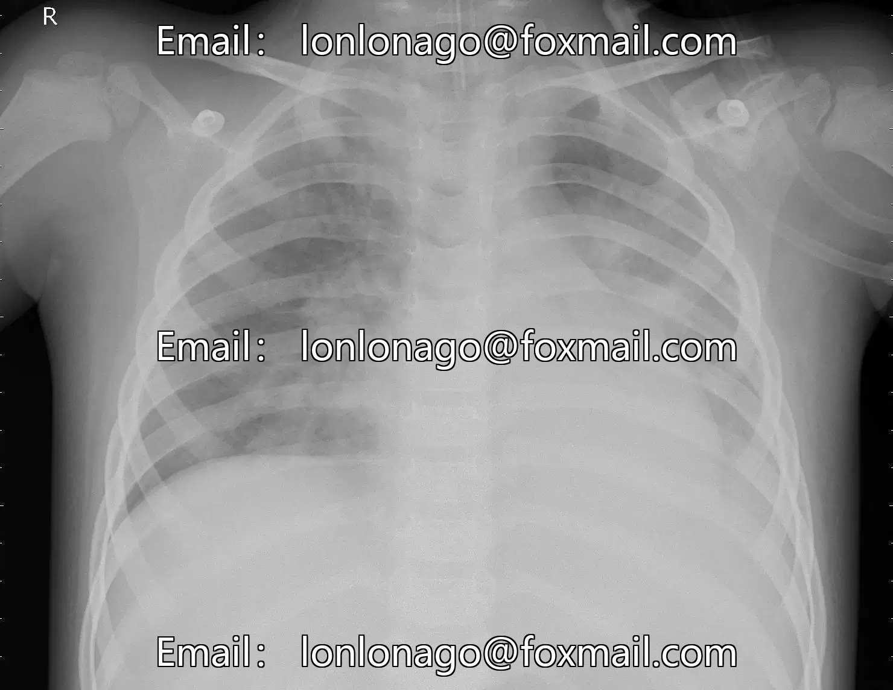

## Body

The Pneumonia Chest X-ray Image Dataset is a medical image collection specifically designed for the development and evaluation of machine learning models for pneumonia detection and classification. The dataset is divided into two main folders: "Training" and "Test", facilitating the training and testing phases of model development.

Dataset Structure:
The "train" folder contains a complete set of chest X-ray images used as training data for machine learning models. Within the "train" folder, there are three different subfolders representing different types of pneumonia:
   - Bacterial Pneumonia: This subfolder contains chest X-ray images showing cases of pneumonia caused by bacterial infections.
   - Viral Pneumonia: The images in this subfolder demonstrate cases of pneumonia caused by viral infections.
   - Normality: The third subfolder contains normal chest X-ray images.

The "Test" folder is specifically used to evaluate the performance of machine learning models on new, unseen data.
It includes chest X-ray images similar to those in the "Training" folder but without duplicate samples.

Training set image data: 5216
Test set image data: 40

Key Features:
      Image Diversity: The dataset contains various chest X-ray images covering different manifestations of pneumonia in different patients.
      Three Types of Pneumonia: The classification task requires distinguishing between bacterial, viral, and fungal pneumonia, enabling the development of models with specific diagnostic capabilities.
      Application Relevance: The dataset reflects the complexity and challenges encountered in real-world medical imaging scenarios.
      Balanced Distribution: Measures have been taken to maintain an even distribution of cases across the three types of pneumonia, ensuring that the model has sufficient instances of each category during training.

Researchers and developers can use this dataset to train and evaluate machine learning models for accurately detecting and classifying pneumonia from chest X-ray images. The dataset is clearly divided into training and testing subsets, categorized by the three types of pneumonia, enhancing its universality and applicability for a wide range of research purposes.

Electronic virtual products are not returnable.

## Images

item_1028766877422

Here is a pay link on Stripe ( https://buy.stripe.com/3cs8yP7sY87d0vu9AB ). Please contact me lonlonago@foxmail.com after funding $89, and I will send you a complete data files , thank you!

